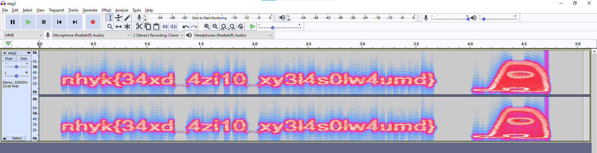

Take your pick of pre-existing checklists:

- www.programmersought.com/article/97354475952/
- https://fareedfauzi.gitbook.io/ctf-checklist-for-beginner/steganography
- (combining yesterday's pearl) www.google.com/search?q=dcode.fr+audio+stego

At some point in my flailing and googling, I finally came across "Spectrogram View".
So, I downloaded Audacity, spent some minutes just trying to _find_ the spectrogram view, but finally...



Then, misread the flag and plop it into `ciphey`
([CyberChef](https://gchq.github.io/CyberChef/#recipe=ROT13(true,true,false,-5)&input=bmh5a3szNHhkXzR6aTEwX3h5MzE0czBsdzR1bWR9)
works too):

```shell
$ ciphey -t "nhyk{34xd_4zi10_xy314s0lw4umd}"
Possible plaintext: 'ictf{34sy_4ud10_st314n0gr4phy}' (y/N): y
╭───────────────────────────────────────────────────────╮
│ The plaintext is a Capture The Flag (CTF) Flag        │
│ Formats used:                                         │
│    caesar:                                            │
│     Key: 5                                            │
│     Plaintext: "ictf{34sy_4ud10_st314n0gr4phy}"       │
╰───────────────────────────────────────────────────────╯
```

Try to submit this, and get an error. Realize the 1 in `st314n0gr4phy` should be a `g`,
and submit the flag: `ictf{34sy_4ud10_st3g4n0gr4phy}`.
