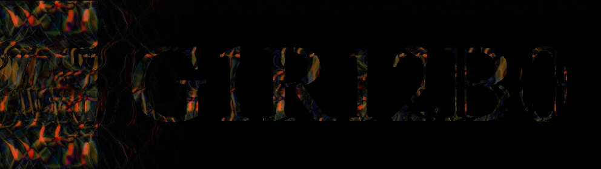
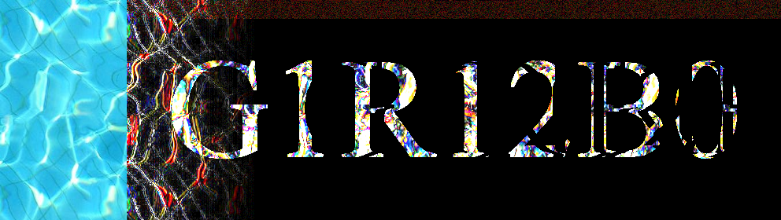
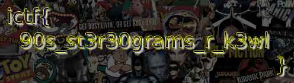

This one was pretty much impossible for me.

I spent 2 hours finding that there was a cycle of length `161`, then removing the background
to create `freq.out.png`, and then staring at it not knowing what to do next.

After I opened a support ticket, I found out this was a stereogram. Plugging it into 
[a stereogram solver](https://magiceye.ecksdee.co.uk/),
I get `G 1 R 1 2 B 0`:

Turns out the script I wrote does this pretty well, and gives me a way to up the contrast:

The fuzzy red and tiny bits of green at the top all the way through are the giveaway that
there's a message in the least significant bits of the image.

Then, I spent another couple hours trying to correctly extract least significant bits,
guessing whether I should be extracting from the original or the stereogram-solved,
and trying to put the streams together in a couple different ways to no luck.

I got some more help in my support ticket, and was told that each of the bits need to 
be interleaved, and that the order of `R1, R2` probably needed to be reversed.

After debugging some more and implementing that change, the flag pops out:

`ictf{90s_st3r30grams_r_k3wl}`

---

It turns out all of this was doable in seconds using `Stegsolve.jar`.
