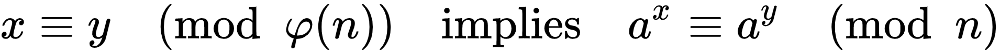

Just RSA.

With some testing, or by just looking, you can find out that the function `f(x,y)`
simply computes `pow(x,y,n)`.

From the tests on the input, you can see that the `flagnum` needs to be a number
such that `pow(pow(x,y,n),flagnum,n) ^ x == 0`.

Knowing properties of `xor`, this is the same as `pow(pow(x,y,n),flagnum,n) == x`.

Knowing some properties of exponentiation, this is the same as`pow(x, y * flagnum, n) == x`.

And the easiest way to do that, is to ensure that `pow(x, y * flagnum, n)` becomes just
`pow(x, 1, n)`, which is obviously exactly `x`.

Look up a corollary of
[Fermat's Little Theorem](https://en.wikipedia.org/wiki/Fermat's_little_theorem#Generalizations):

In fact, if you read a little further, you can find a mention about how RSA works, and about
how FLT relates to it.

Find what `phi(n)` stands for: in our case, `n = (P1 - 1) * (P2 - 1)`.

We need to find `flagnum` such that `(y * flagnum) % phi(n) == 1`.  
I.e, `flagnum` with that `flagnum % phi(n) == y ** -1  % phi(n) `.

There we have it! Define `flagnum = pow(y, -1, (P1 - 1) * (P2 - 1))`.

Change the integer to bytes to get the flag: 
`ictf{the_abuse_of_the_initials_of_rivest_shamir_and_adelman_is_criminal}`
